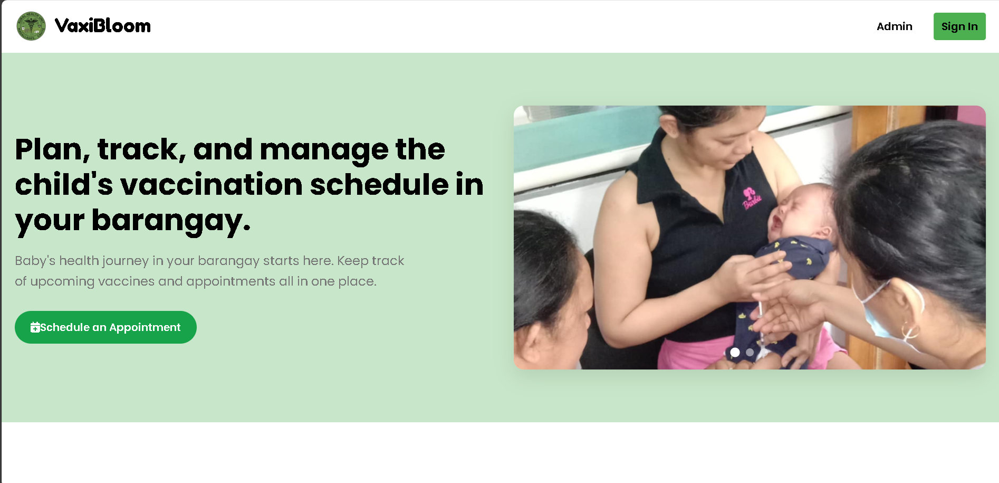
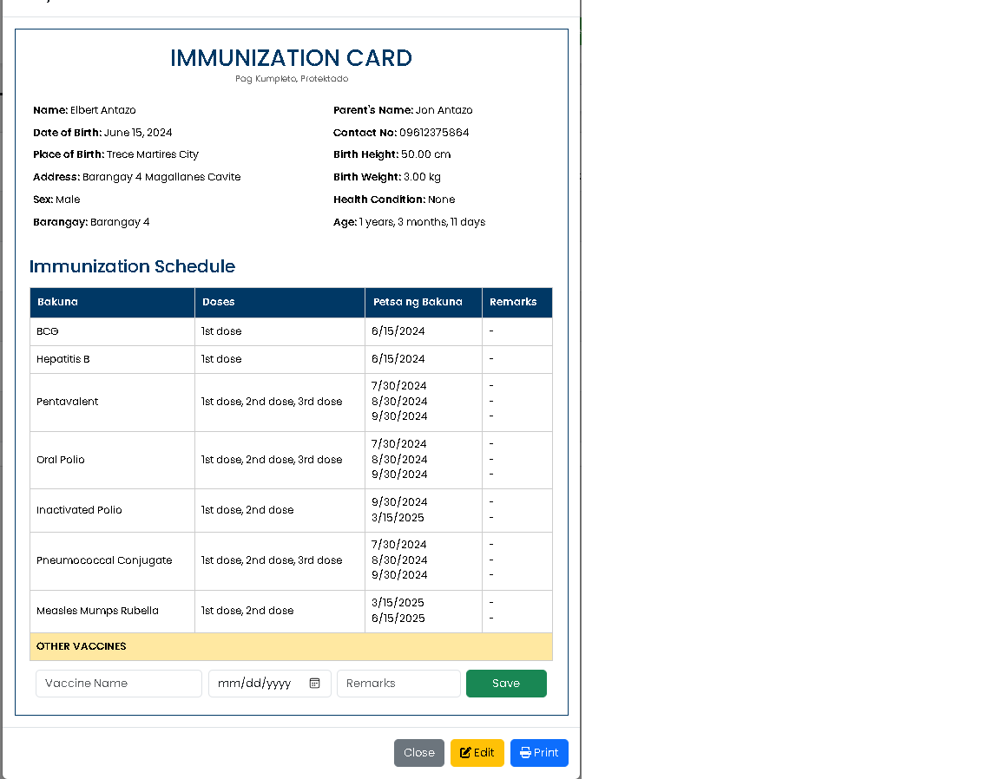
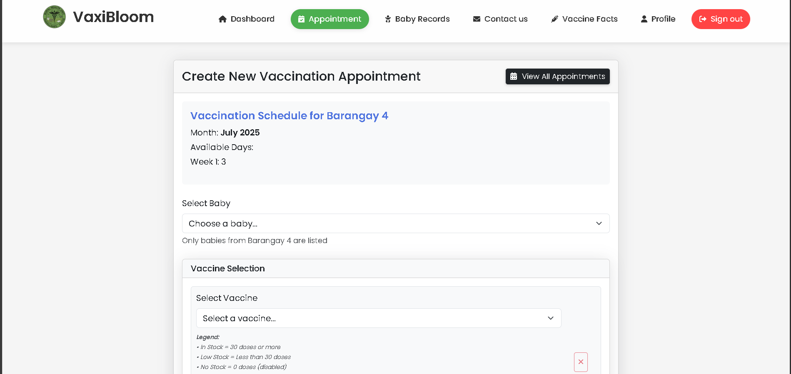
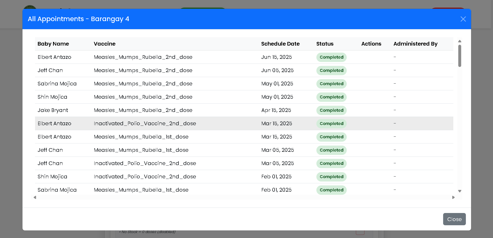
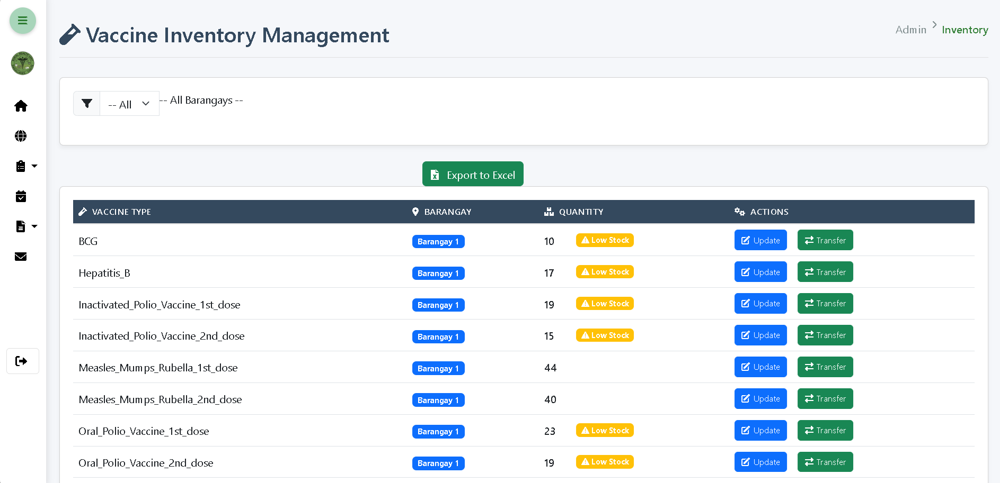
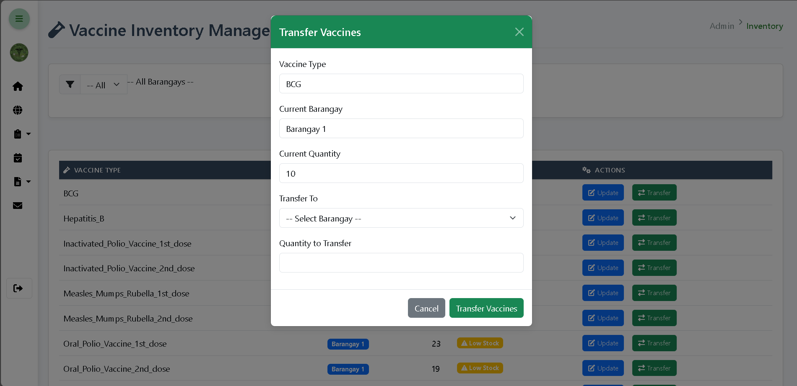
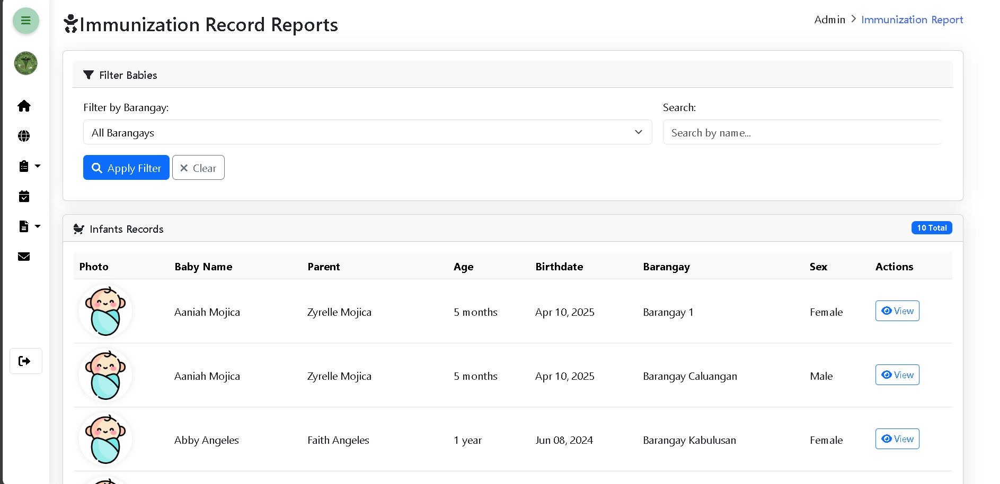
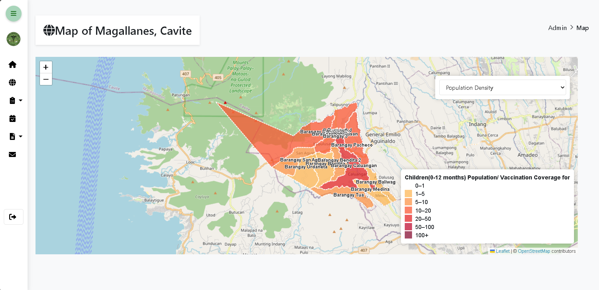

# 🍼 VaxiBloom (Infant Immunization System)

A web-based system that helps Barangay Health Workers (BHW) and the Rural Health Unit (RHU) manage infant vaccination appointments, records, and vaccine inventory.  
It ensures age eligibility, dose dependencies, vaccine stock tracking, and prevents duplicate/completed vaccinations.

## 📸 Main Preview

## 📂 Screenshots by Module

  
👶 Baby Records

    
  

  
📅 Appointments

    
  

  
📦 Vaccine Inventory

    
  

  
📊 Reports & Mapping

    
  

---

## 🔧 Built With
- HTML  
- CSS  
- JavaScript  
- Bootstrap  
- PHP  
- MySQL  
- Infinity Free  

## 👥 User Roles & Features

### 👩‍⚕️ Barangay Health Worker (BHW)
- 📅 Schedule infant vaccination appointments (with age & dose checks)  
- 🧾 Manage and view baby vaccination records in their barangay  

### 🏥 Admin (RHU)
- 📊 View vaccination mapping and barangay statistics  
- 📦 Manage vaccine inventory (add, update, transfer stocks between barangays)  
- 📑 Export vaccine stock records to **Excel** for reporting  
- ✅ Ensure system rules (age, dose dependencies, duplicate checks, stock availability)  

---

## 📑 Sample Download
📥 [Download Sample Vaccine Stock Report (Excel)](assets/vaccine-stocks-sample.xlsx)

---

